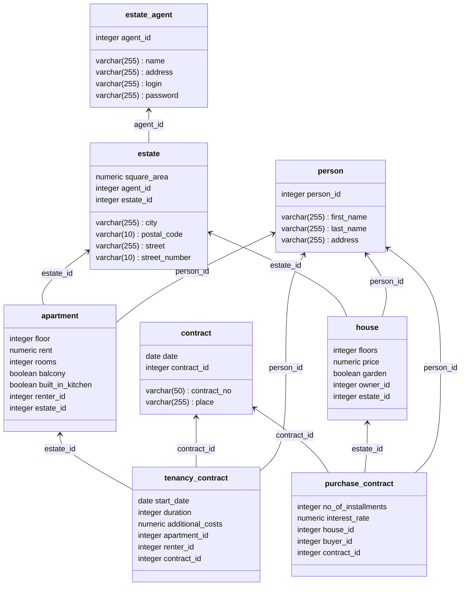

# Java application for management of real estates

## ER Diagram

```mermaid
classDiagram
    direction BT
    class apartment {
        integer floor
        numeric rent
        integer rooms
        boolean balcony
        boolean built_in_kitchen
        integer renter_id
        integer estate_id
    }
    class contract {
        varchar(50) contract_no
        date date
        varchar(255) place
        integer contract_id
    }
    class estate {
        varchar(255) city
        varchar(10) postal_code
        varchar(255) street
        varchar(10) street_number
        numeric square_area
        integer agent_id
        integer estate_id
    }
    class estate_agent {
        varchar(255) name
        varchar(255) address
        varchar(255) login
        varchar(255) password
        integer agent_id
    }
    class house {
        integer floors
        numeric price
        boolean garden
        integer owner_id
        integer estate_id
    }
    class person {
        varchar(255) first_name
        varchar(255) last_name
        varchar(255) address
        integer person_id
    }
    class purchase_contract {
        integer no_of_installments
        numeric interest_rate
        integer house_id
        integer buyer_id
        integer contract_id
    }
    class tenancy_contract {
        date start_date
        integer duration
        numeric additional_costs
        integer apartment_id
        integer renter_id
        integer contract_id
    }

    apartment  -->  estate : estate_id
    apartment  -->  person : person_id
    estate  -->  estate_agent : agent_id
    house  -->  estate : estate_id
    house  -->  person : person_id
    purchase_contract  -->  contract : contract_id
    purchase_contract  -->  house : estate_id
    purchase_contract  -->  person : person_id
    tenancy_contract  -->  apartment : estate_id
    tenancy_contract  -->  contract : contract_id
    tenancy_contract  -->  person : person_id
```