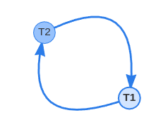

# Exercise 03

## 3.1 Isolation Levels

### a)

    Read uncommitted
    Read committed
    Repeatable read
    Serializable

The current isolation level of dis-2024:

    SQL: SHOW TRANSACTION ISOLATION LEVEL;
    Output: read committed

### b)

[Solution to b)](3_1/b.sql)

### c)

[File 1](3_1/c_1.sql) and [file 2](3_1/c_2.sql).

Output:

    sheet3,AccessShareLock,true

### d)

Output:

    sheet3,AccessShareLock,true
    sheet3,SIReadLock,true

## 3.2 Lock Conflictssops

### a) 

Files: [no autocommit](3_2/a_n_autocommit.sql) and [with autocommit](3_2/a_w_autocommit.sql)

The new row will be inserted into the table, but is not being shown by the select statement from the connection with no autocommit performing the query.

In this case it is not a problem, but if we would perform further transactions, using the selected values, we can encounter inconsistency.

### b)

### c)

Transaction 2 has to wait until transaction 1 is finished. Afterwards the the following error is being thrown:
    dis-2024> UPDATE sheet3 SET name='update2' WHERE id = 2
    [2024-05-06 19:40:46] [40001] ERROR: could not serialize access due to concurrent update

### d)

Editing (update or delete) the same row from two different transactions will lead to abort/rollback.

### e)

Updating the same row in swapped order from two different connections will result in a deadlock:

    [40P01] ERROR: deadlock detected Detail: Process 40769 waits for ShareLock on transaction 3137204; blocked by process 40772. Process 40772 waits for ShareLock on transaction 3137203; blocked by process 40769. Hint: See server log for query details. Where: while updating tuple (0,11) in relation "sheet3"

## 3.3 Scheduling

### a)

    INSERT INTO dissheet3 (id, name) VALUES (1, 'Goofy'),(2, 'Donald'),(3, 'Tick'), (4, 'Trick'),(5, 'Track');

S1:

    c1 reads (1, 'Goofy')
    c2 updates (1, 'Goofy') to (1, 'Mickey')
    c2 commits 
    c1 updates (1, 'Mickey') to (1, 'Mickey + Max')
    c1 reads (1, 'Mickey + Max')
    c1 commits
    ----
    1,Mickey + Max
    2,Donald
    3,Tick
    4,Trick
    5,Track

S2:

    c1 reads (1, 'Goofy')
    c2 updates (1, 'Goofy') to (1, 'Mickey')
    c2 commits
    c1 reads (1, 'Mickey')
    c1 commits
    ----
    1,Mickey
    2,Donald
    3,Tick
    4,Trick
    5,Track

S3:

    c2 reads (1, 'Goofy')
    c1 updates (1, 'Goofy') to (1, 'Mickey')
    c1 updates (2, 'Donald') to (2, 'Minnie')
    c1 commits
    c2 reads (2, 'Minnie')
    c2 updates (1, 'Mickey') to (1, 'Donald')
    c2 updates (2, 'Minnie') to (2, 'Daisy')
    c2 commits
    ----
    1,Donald
    2,Daisy
    3,Tick
    4,Trick
    5,Track

### b)

S1:

    1,Mickey
    2,Donald
    3,Tick
    4,Trick
    5,Track

S2:

    1,Mickey
    2,Donald
    3,Tick
    4,Trick
    5,Track

S3:

    1,Mickey
    2,Minnie
    3,Tick
    4,Trick
    5,Track

### c)

The result does differ and SQL throws an error:

    ERROR: could not serialize access due to concurrent update

The conflict graph would look like this:

Therefore not serializable.
